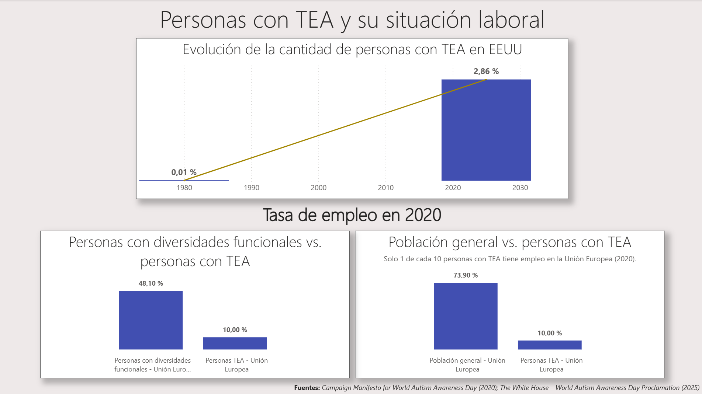

# 🧩 Autism & Employment Insights Dashboard

**Created:** 2025\
**Last updated:** 13/11/2025

------------------------------------------------------------------------

## 🖼️ Preview

 ➡️ **Note:** The dashboard is in **Spanish**, as it was designed for a Spanish-speaking company.

**Dashboard Files:**\
- [Download `.pbix` file](Dashboard.pbix)

------------------------------------------------------------------------

## 🎯 Goal

This project analyzes both the **evolution of autism (ASD) prevalence in children** and the **employment gap between the general population, people with disabilities and autistic adults**.

It was created as a **real-case-style project targeted at Lago Becu**, a Spanish company based in Valencia that runs the LIPS project (Labour Inclusion for People with Autism), focus on improving labor inclusion for people with autism.

------------------------------------------------------------------------

## 📊 Results

The dashboard highlights:

-   A **significant and long-term increase** in autism prevalence since the 1980s.\
-   A large **employment gap** between the general population and adults with ASD, even between other people with disabilities and people with ASD.\
-   The importance of stronger labor inclusion strategies and support programs.

📉 **Limitations** - The analysis is based on publicly available sources that already aggregated or pre-processed the data; large raw datasets from official statistical databases were not imported or modeled directly.\
- Results depend on heterogeneous reporting standards across countries and years.\
- No detailed sociodemographic segmentation (age, gender, education level) was included.\
- The employment gap could be updated using 2025 labour statistics to build a more granular and current model.

------------------------------------------------------------------------

## ⚙️ Process

1.  **Data Extraction**
    -   Collection of autism prevalence and employment data from public international sources.\
    -   Extraction of key metrics from official documents and institutional reports.
2.  **Data Cleaning & Structuring (Excel / Power BI)**
    -   Normalization of numerical and temporal values.\
    -   Standardization of formats to enable consistent comparisons and visuals.\
    -   Calculation of proportions such as *children diagnosed with ASD vs. total number of children*.
3.  **Data Modeling (Power BI)**
    -   Imported the already structured tables from Excel, with all formatting and proportion calculations prepared beforehand.\
    -   Built a simple, clean data model including historical evolution, employment data, and source reference tables.\
    -   Created basic relationships to allow the dashboard to display the evolution of ASD prevalence and employment rate comparisons correctly.
4.  **Visualization (Power BI)**
    -   A **dashboard** structured into three key blocks:
        -   Evolution of autism prevalence in children.\
        -   Employment rate comparison:
            -   General population vs. people with ASD.\
            -   People with disabilities vs. people with ASD.
    -   Clean, accessible layout designed for clear storytelling.

------------------------------------------------------------------------

## 🧰 Tools & Technologies

-   **Excel** → initial cleaning and preprocessing\
-   **Power BI** → data modeling and visualization

**Data Sources:**\
- [Campaign Manifesto for World Autism Awareness Day (Autism-Europe, 2020)](https://www.autismeurope.org/wp-content/uploads/2020/06/WAAD-2020_Manifesto_EN.pdf)\
- [World Autism Awareness Day Proclamation (The White House, 2025)](https://www.whitehouse.gov/presidential-actions/2025/04/world-autism-awareness-day-2025)\
- [Diagnostic and Statistical Manual of Mental Disorders, 5th Edition (DSM-5), American Psychiatric Association, 2013](https://doi.org/10.1176/appi.books.9780890425596)

------------------------------------------------------------------------

## 🚀 Next Steps

-   Add regional segmentation (Europe, U.S., Spain).\
-   Add gender-based segmentation of employment rates.\
-   Add age-group analysis to detect differences in inclusion across life stages.\
-   Add education-level segmentation to understand how qualification impacts employment outcomes for adults with ASD.\
-   Include sector-based employability analysis for adults with ASD.\
-   Integrate recent surveys on workplace inclusion practices.\
-   Add a simulation tool to estimate the impact of new inclusion policies.

------------------------------------------------------------------------

**Author:** [Pablo](https://github.com/PabloDataAnalyst) © 2025 Published for portfolio purposes.\
**License:** MIT License.